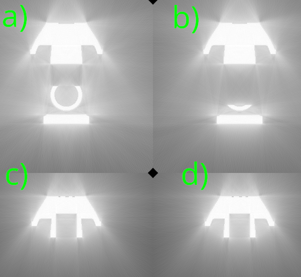
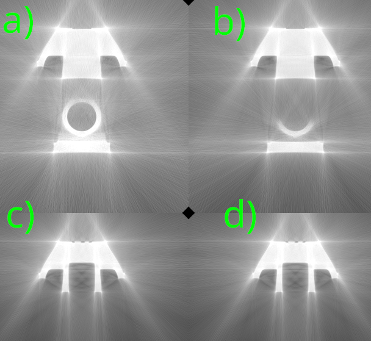
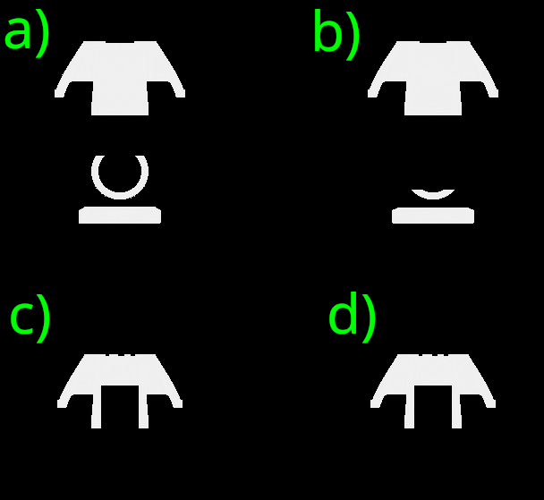
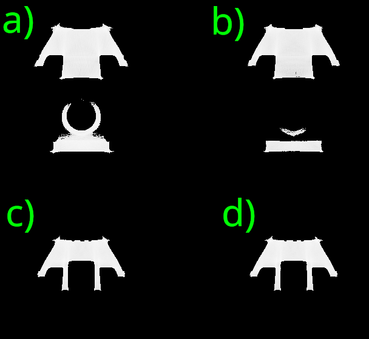
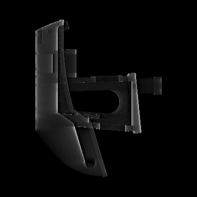
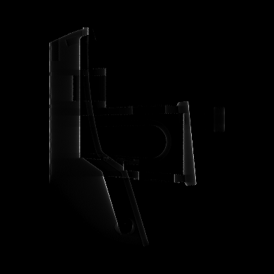
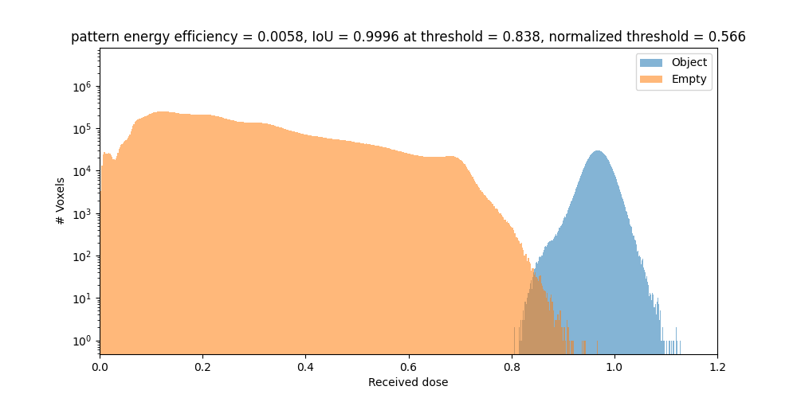
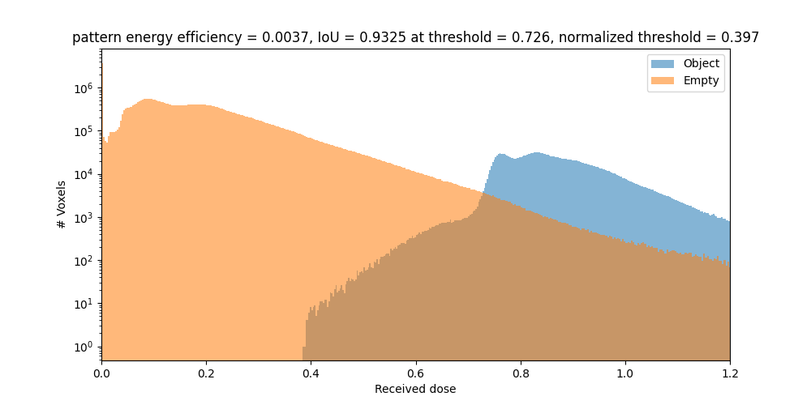

# Benchmarks of Dr. TVAM

## Comparison of filtered backprojection vs Dr.TVAM

### Reconstruction Results Comparison

All physical parameters are specified in [this config file](https://github.com/EPFL-LAPD/Dr.TVAM_benchmarks/blob/main/radon_vs_drtvam.json). Most notable, the attenuation coefficient is $\mu = 0.1 \frac{1}{\mathrm{mm}}$.
The Radon transform assumes a $\mu \ll 1$, so in this case this requirement is violated (as in most realistic printing scenarios).

| Method | Dr. TVAM | Positive Filtered Backprojection |
|--------|----------|----------------------------------|
| **Intensity** |  |  |
| **Best Thresholded Intensity** |  |  |
| **Pattern for one angle** |  |  |
| **Histogram** |  |  |

## Speed Benchmarks

### Hardware Specifications

* **RTX3060 12GB (2020)**: Entry-level consumer hardware GPU, priced around **~300USD**.
* **L40S 48GB (2022)**: Professional graphics card used primarily in server clusters, priced around **5000USD**.

### Test Subjects

* **Dr. TVAM**: Tested on **RTX3060 12GB** and **L40S 48GB**.
* **Benchy** boat as target:
  * Size: **10mm**
  * Pixel size: **25µm**
  * Resolution on DMD: **400x400 pixels**
  * Angles: **400**
  * 40 iterations with gradient-based L-BFGS optimizer

* The Julia based (attenuated) Radon transform is using the same parameters and optimizer.
### Computation Performance

| Configuration | Rays per Pixel |  Time (RTX3060) |  Time (L40S) |
| --- | --- | --- | --- |
| Single backprojection (adjoint Radon) in Julia | 1 | **0h 0m 1s** | |
| Julia (attenutaed) Radon based | 1 | **0h 3m 17s** |  |
| Dr. TVAM index-matched | 1 | **0h 2m 2s** | **0h 0m 20s** |
| Dr. TVAM cylindrical | 1 | **0h 2m 10s** | **0h 0m 23s** |
| Dr. TVAM square | 1 | **0h 2m 15s** | **0h 0m 20s** |
| Dr. TVAM cylindrical scattering | 16 | **1h 40m 0s** | **0h 14m 10s** |
| Dr. TVAM square scattering | 16 | **1h 40m 0s** | **0h 14m 20s** |
| Dr. TVAM square scattering (surface-aware loss, disable black pixels) | 16 | **0h 25m 0s** | **0h 3m 45s** |
